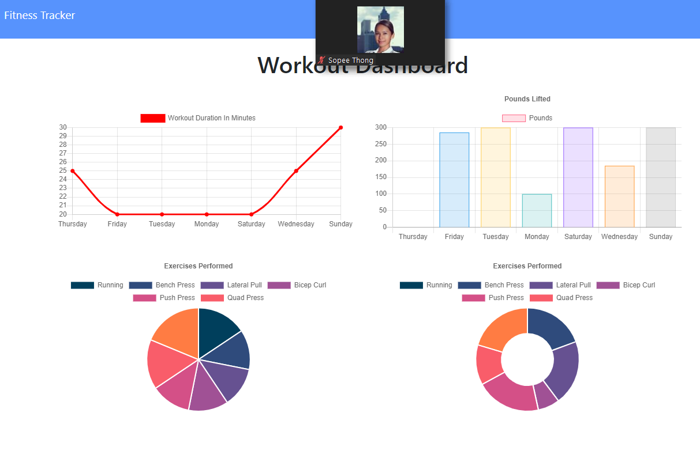

# Fitness Tracker
## Description
This application allows users to view, create, and track daily workouts. Users are able to log multiple exercises in a given day. Other items tracked include the name, type, weight, sets, reps, duration, and distance traveled (for cardio exercises). In addition to logging workouts, this app also provides a dashboard which provides stats from your workouts over the last seven days.
## Instructions
Once you have loaded the app, select create new workout and an exercise by choosing between Resistance and Cardio and then providing information about the exercise (name, weight, sets, reps, and duration for resistance and name, distance, and duration for cardio). Once the form is complete, you can choose to Complete the workout for that day or Add Exercise to add additional exercises for that day. Upon completing a workout, you are returned to the homepage where you see your last workout. To view your stats, select Dashboard from the navigation on the homepage to view charts illustrating your progress.

[Deployed App](https://stormy-brook-70744.herokuapp.com/)

